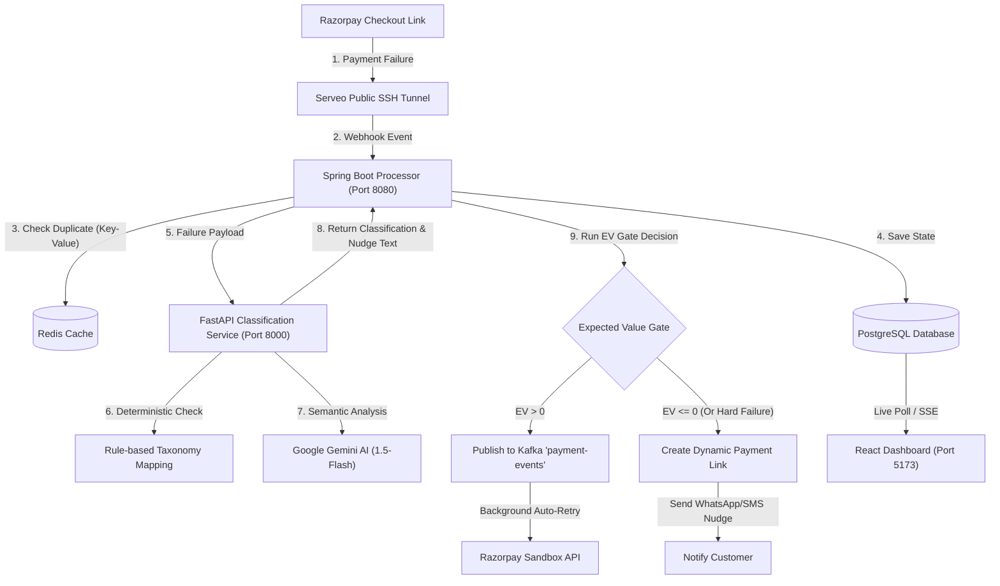

# AI-Powered Revenue Recovery Agent (Razorpay Buildathon 2026)

The **AI-Powered Revenue Recovery Agent** is a real-time system designed to tackle payment failures, reduce customer drop-offs, and optimize recovery costs for e-commerce merchants using Razorpay.

Instead of blindly retrying failed payments, which can increase customer friction and expose the transaction to repeated bank-side declines or throttling, this system uses a combination of **Heuristic Rule Engines**, **Google Gemini AI**, and **Expected Value (EV) Decision Gates** to decide whether to automatically retry a transaction or nudge the customer with a custom recovery payment link.

> [!NOTE]
> **Track Scope Focus:** The Razorpay Buildathon Track 3 brief covers multiple areas (subscriptions, voice, mandates, checkout drop-offs). This project goes deep into **Payment Failure Detection, Diagnosis & Recovery** to build a high-fidelity, production-shaped prototype recovery agent with real-time webhooks, deterministic heuristics, LLM classification, and expected-value retry gates.

> [!IMPORTANT]
> **AI Positioning & Decision Authority:** We intentionally keep AI away from financial decisioning — Gemini handles semantic ambiguity in classification and customer nudge generation; a deterministic policy engine holds all financial authority.

---

## ⚡ 30-Second Demo: The ₹1,945 Recovery Lifecycle

To see how the recovery agent operates in practice, trace transaction `pay_REHEARSAL_202` (₹1,945.00) through the end-to-end recovery pipeline:

1. **Failure Ingestion:** A customer's card payment of ₹1,945 fails on Razorpay Checkout. The gateway delivers a `payment.failed` webhook with error code `BANK_TIMEOUT` ("Bank server timeout.").
2. **Deduplication:** Redis captures key `dedup:pay_REHEARSAL_202` with a TTL lock, preventing race conditions and double charging from duplicate webhook retries.
3. **Diagnostic Classification:** The heuristic rule engine resolves `BANK_TIMEOUT` against the NPCI Technical Decline taxonomy in <5ms → categorized as **Soft Failure** (100% confidence; Gemini LLM bypassed to eliminate latency and API cost).
4. **EV Gate Check (Attempt 1):**
   Recovery probability is $P_{\text{recovery}} = 0.50$; modeled costs are ₹0.70 (₹0.50 bank throttle risk + ₹0.20 customer friction base):

   $$\text{EV} = (0.50 \times ₹1,945) - ₹0.70 = +₹971.80 > 0$$

   *Decision:* **Auto-Retry Approved.**
5. **Simulated Retry Execution:** Attempt #1 is dispatched against Razorpay sandbox APIs. If the issuing bank host remains degraded:
6. **Recalculation & Dynamic Fatigue (Attempt 2):**
   $P_{\text{recovery}}$ decays to $0.20$; customer friction cost increases ($+₹2.00$ dynamic fatigue, Total Cost = ₹2.70):

   $$\text{EV} = (0.20 \times ₹1,945) - ₹2.70 = +₹386.30 > 0$$

   *Decision:* **Second Auto-Retry Approved.**
7. **Final Gate Check (Attempt 3):**
   $P_{\text{recovery}}$ drops to $0.05$; customer friction cost increases ($+₹2.00$ dynamic fatigue, Total Cost = ₹4.70):

   $$\text{EV} = (0.05 \times ₹1,945) - ₹4.70 = +₹92.55 > 0$$

   *Decision:* **Marginally positive; final autonomous retry attempt allowed under policy.**
8. **Resolution & Hard Ceiling Enforcement:**
   - **If retry succeeds:** The transaction transitions to `RECOVERED` (₹1,945 saved, merchant ledger credited, audit trail completed).
   - **If retry fails:** The hard 3-retry ceiling is reached (`currentAttempt >= maxRetries`). Autonomous retries halt immediately to protect the customer from bank-side card blocking. The transaction is marked `ESCALATED`, and the system automatically generates a dynamic Razorpay payment link sent via a personalized WhatsApp/SMS customer nudge.

---

## 🏗️ System Architecture & Services

The application consists of three main services, supported by Kafka and Redis infrastructure:



### 1. Core Services Setup
* **`payment-processor` (Spring Boot, Port 8080):**
  Houses the core state machine and Kafka message listeners. Uses PostgreSQL for persistence in the containerized (`docker`) profile; falls back to in-memory H2 for local/native development.
* **`classification-service` (FastAPI + Python, Port 8000):**
  Hosts the failure classification engine and Gemini API client. It categorizes errors into **Soft Failures** (transient network issues) or **Hard Failures** (limits, invalid details).
* **`dashboard-frontend` (React + Tailwind CSS + TypeScript, Port 5173):**
  Provides a real-time web portal showing transaction ledgers, audit trails, and financial recovery metrics.
* **`infrastructure` (Docker Compose):**
  Manages Kafka (KRaft mode) for transaction message queues and Redis for webhook deduplication.

---

## 🔄 Core Ingestion & Recovery Pipelines

### A. Webhook Ingestion & Redis Deduplication
1. Razorpay sends a `payment.failed` event to the `/api/events/ingest` endpoint.
2. The `payment-processor` intercepts the request and queries **Redis** with the payment ID (`rzp_payment_id`).
3. If the key exists, the request is flagged as a duplicate and ignored. If it is new, it is locked in Redis and saved to the database as `PENDING`.

### B. Failure Taxonomy & Gemini Classification
When a transaction fails, it is sent to the FastAPI classification service. It processes the error in two layers:
1. **Rule Engine:** Matches deterministic codes (e.g., `LIMIT_EXCEEDED` → Hard, `BANK_TIMEOUT` → Soft).
2. **Gemini LLM (Gemini 1.5-Flash):** If the error code is unknown or ambiguous, Gemini parses the failure message semantically to determine if it is retryable, returning a JSON response.
3. **Nudge Generation:** If the failure is a Hard error, Gemini generates a custom, friendly, 15-word customer nudge copy adapted to the failure context.

### C. The Expected Value (EV) Decision Gate
For transient Soft Failures, the backend decides whether to auto-retry based on expected profit vs friction costs:

$$
\text{EV} = (P_{\text{recovery}} \times \text{Amount}) - \text{Total Cost}
$$

Where:
* $P_{\text{recovery}}$ is the configured recovery probability for the failure subtype and retry attempt. In the synthetic evaluation, this probability is provided by the test dataset; in a production system, it could be continuously estimated from historical recovery outcomes.
* **Total Cost** consists of modeled retry-related risks and costs, including bank-throttle risk (repeated attempts risking the bank flagging/throttling the card) and customer-friction base costs.
* **Customer Fatigue (Friction Cost):** Every retry adds a delay penalty (`currentAttempt` × ₹2) representing loss of customer interest and increased risk. If $\text{EV} > 0$, the system pushes the event to **Kafka** to trigger a background retry. If $\text{EV} \le 0$, it terminates retries and sends a customer nudge.

### D. Probability Calibration & Production Roadmap

A critical technical question for any algorithmic recovery system is: **"Why should merchants trust the recovery probability $P_{\text{recovery}}$?"**

* **Current Prototype Implementation:** The current build uses a fixed synthetic calibration table seeded from empirical Indian payment gateway and cart-recovery benchmarks (e.g., transient network timeouts yield $\sim 65\%$ recovery odds on attempt 1, decaying predictably across successive attempts).
* **Production Calibration Architecture:** In an enterprise production deployment, $P_{\text{recovery}}$ would not be a static lookup. It would be continuously calibrated by an empirical ML calibration engine trained on historical settlement outcomes across four vectors:
  1. **Failure Subtype & Gateway Reason Code:** Granular error classification (e.g., transient switch timeout vs. core-banking host downtime).
  2. **Payment Method & Rail:** Segmented recovery models differentiating UPI (instant retry / PSP handles), Net Banking, and Card networks (Visa, Mastercard, RuPay).
  3. **Issuing Bank Real-Time Telemetry:** Live PSR degradation tracking per issuer (e.g., detecting if HDFC or SBI switch is currently experiencing an outage).
  4. **Attempt Decay & Elapsed Time Curves:** Empirical survival curves accounting for customer drop-off over elapsed minutes and issuer fraud cooling windows.

### E. Autonomous Guardrails
To prevent runaway scripts and contain financial risk, the engine enforces three explicit guardrails:
* **High-Value Guardrail:** Transactions exceeding ₹50,000 are blocked from auto-retries and routed directly to the `ESCALATED` human queue.
* **Low-Confidence Guardrail:** If the failure diagnosis confidence (heuristic or LLM-based) falls below 70%, the transaction is immediately escalated to avoid incorrect recovery actions.
* **Retry Ceiling Guardrail:** Autonomous retries are capped at a maximum of 3 attempts. Upon reaching the ceiling, the transaction is marked as `ESCALATED` and routed to the human exception queue to avoid bank-throttling.

### F. Verified Evaluation Results
When evaluated against the standard 200-transaction simulation batch (Day 2 dataset), the system produced these canonical outcomes:
* **Soft Decline Recovery Rate:** **43.6%** (88 transactions successfully recovered).
* **Recovered Revenue:** **₹5,86,530.23** of otherwise permanently lost volume.
* **Wasted Costs (Fails):** Optimized to **₹0.00** (the EV gate correctly terminated retry attempts before they became unprofitable).
* **Human Queue Escalations:** **13 transactions** safely routed to human exception handling.

---

## 📊 Dataset Loading & Verification
To test the system at scale, you can ingest a synthetic dataset representing hundreds of transactions:

1. **`generate_dataset.py`:** Generates 200 mock transactions representing technical declines, timeouts, blocked cards, and insufficient funds.
2. **Kafka Producer:** Publishes these events directly to the Kafka pipeline (`payment-events`).
3. **Ledger Update:** The backend processes these events asynchronously, showcasing how the Expected Value gate and the rules handle high volume on your React dashboard.

---

## 💡 Domain Concepts & Hackathon Highlights

### A. NPCI Decline Standards (National Payments Corporation of India)
Our failure categorization directly matches NPCI guidelines used by Indian banks and gateways (like UPI & RuPay):
* **Technical Declines (TD):** Failures due to bank host downtime, network timeout, connection drops, or system unavailability. *Operationally, these are transient and safe for automatic background retries.*
* **Business Declines (BD):** Failures due to insufficient funds, customer cancellation, incorrect OTP/PIN inputs, card limits, or security blocks. *Operationally, these are deterministic and require user intervention (a nudge).*

### B. Mathematical Definitions of Dashboard Metrics

#### 1. Recovery Rate
The percentage of recovered payment volume relative to total failed transactions:

$$
\text{Recovery Rate} = \left( \frac{\text{Recovered Count}}{\text{Total Ingested}} \right) \times 100
$$

#### 2. False-Retry Wasted Cost
Sum of modeled retry costs spent on retry attempts that ultimately still failed (the direct metric optimized by the Expected Value Gate):

$$
\text{Wasted Cost} = \sum (\text{Retry Cost} + \text{Bank Throttle Risk Cost})
$$

#### 3. Realized Recovery Gains
Total transaction volume successfully recovered via automated retries and smart nudges.

### C. Redis Deduplication Schema
To prevent duplicate webhook processing during network retries, the processor uses Redis as a lock store:
* **Key Schema:** `dedup:<transaction_id>` (locks active transactions with a TTL).
* **Action:** Incoming webhooks check this key. If the key exists, the message is immediately acknowledged and discarded, preventing race conditions or double-charging.

---

## 🛠️ What Broke & How We Fixed It

Building a real-time recovery agent combining live payment webhooks, Kafka event streaming, and LLM reasoning uncovered several non-trivial engineering bottlenecks:

1. **Flaky Public SSH Tunnels Mid-Evaluation:**
   - *Problem:* While testing live Razorpay webhook callbacks via free public reverse tunnels (Serveo / Pinggy), tunnels intermittently timed out, dropped TCP sockets, or changed domain endpoints, breaking the live ingestion pipeline mid-demo.
   - *Fix:* Built a local REST replay endpoint (`/api/events/ingest`) alongside an automated PowerShell startup script (`start_services.ps1`) and ingestion test harness (`scripts/trigger_rehearsal.py`). This allows deterministic, zero-dependency local simulation of identical Razorpay webhook payloads without relying on third-party tunnel stability.

2. **LLM Latency & API Rate Limits on Batch Replays:**
   - *Problem:* Routing every incoming transaction through Google Gemini 1.5-Flash added a 1–2 second latency overhead per event and risked hitting quota rate limits during 200-transaction simulation batches.
   - *Fix:* Implemented a two-tier decision hierarchy. Deterministic NPCI failure codes (e.g., `BANK_TIMEOUT`, `LIMIT_EXCEEDED`) are mapped instantly by a heuristic rules engine in <5ms. Gemini is reserved exclusively for unmapped or ambiguous free-text errors. Furthermore, if Gemini encounters timeouts or rate limits, the system fails over to a local regex engine with a reduced confidence score (<70%), safely routing uncertain cases to the human exception queue rather than blindly guessing.

3. **In-Flight Duplicate Webhooks & Double Retries:**
   - *Problem:* Under transient network degradation, payment gateways frequently fire duplicate retry webhooks, creating race conditions where multiple consumer threads could trigger duplicate charges on the same transaction.
   - *Fix:* Enforced a two-layer idempotency guardrail: (1) Redis distributed locks (`dedup:<transaction_id>`) with atomic set-if-not-exists and TTL to discard redundant webhook events at the edge, and (2) PostgreSQL terminal state checks (`RECOVERED`, `FAILED`, `ESCALATED`) in `RecoveryEngine` before scheduling any retry job.

4. **Runaway Retries & Bank Throttling:**
   - *Problem:* Naive exponential backoff retries blindly re-attempt failed payments up to $N$ times, irritating customers and triggering issuing bank fraud alarms or card throttling.
   - *Fix:* Replaced fixed retry loops with an Expected Value (EV) decision gate that balances recovery probability against customer friction cost and bank throttle risk. When $\text{EV} \le 0$ or the 3-retry ceiling is reached, retries halt immediately and the flow transitions to human escalation or dynamic Razorpay payment link generation sent via personalized WhatsApp/SMS nudges.

---

## 🚀 Running the Project Locally

### Prerequisites
* Java 21+ & Python 3.10+
* Docker Desktop (running)

### Setup & Launch
1. Clone the repository and configure your `.env` file in the root folder:
   ```env
   GEMINI_API_KEY=your_gemini_api_key_here
   RAZORPAY_KEY_ID=your_razorpay_key_id
   RAZORPAY_KEY_SECRET=your_razorpay_key_secret
   ```
2. Start the Docker containers:
   ```bash
   docker-compose up -d
   ```
3. Run the automated startup script to launch all microservices:
   ```powershell
   powershell -ExecutionPolicy Bypass -File .\start_services.ps1
   ```
4. Access the React dashboard at: **`http://localhost:5173`**
