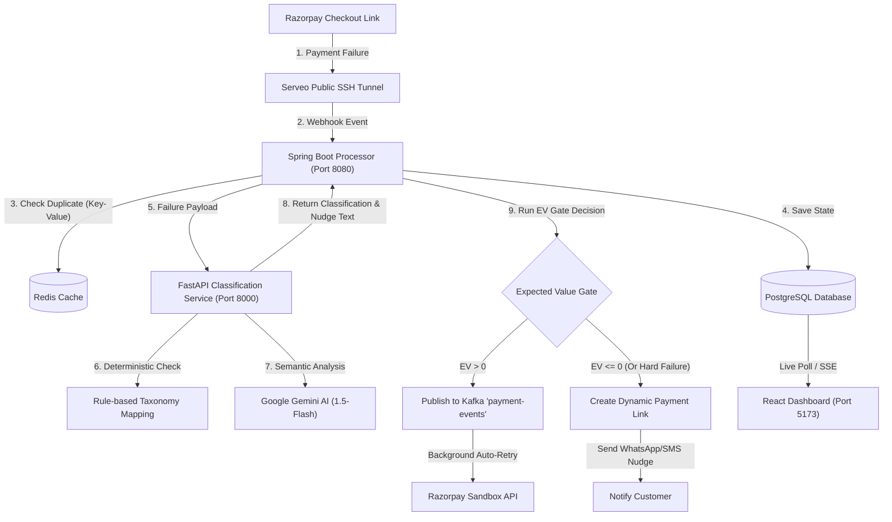

# AI-Powered Revenue Recovery Agent (Razorpay Buildathon 2026)

The **AI-Powered Revenue Recovery Agent** is a real-time system designed to tackle payment failures, reduce customer drop-offs, and optimize recovery costs for e-commerce merchants using Razorpay.

Instead of blindly retrying failed payments, which can increase customer friction and expose the transaction to repeated bank-side declines or throttling, this system uses a combination of **Heuristic Rule Engines**, **Google Gemini AI**, and **Expected Value (EV) Decision Gates** to decide whether to automatically retry a transaction or nudge the customer with a custom recovery payment link.

> [!NOTE]
> **Track Scope Focus:** The Razorpay Buildathon Track 3 brief covers multiple areas (subscriptions, voice, mandates, checkout drop-offs). This project goes deep into **Payment Failure Detection, Diagnosis & Recovery** to build a high-fidelity, production-ready recovery agent with real-time webhooks, deterministic heuristics, LLM classification, and expected-value retry gates.

---

## 🏗️ System Architecture & Services

The application consists of three main services, supported by Kafka and Redis infrastructure:



### 1. Core Services Setup
* **`payment-processor` (Spring Boot, Port 8080):**
  Houses the core state machine and Kafka message listeners. Uses PostgreSQL for persistence in the containerized (`docker`) profile; falls back to in-memory H2 for local/native development.
* **`classification-service` (FastAPI + Python, Port 8000):**
  Hosts the failure classification engine and Gemini API client. It categorizes errors into **Soft Failures** (transient network issues) or **Hard Failures** (limits, invalid details).
* **`dashboard-frontend` (React + Tailwind CSS + TypeScript, Port 5173):**
  Provides a real-time web portal showing transaction ledgers, audit trails, and financial recovery metrics.
* **`infrastructure` (Docker Compose):**
  Manages Kafka (KRaft mode) for transaction message queues and Redis for webhook deduplication.

---

## 🔄 Core Ingestion & Recovery Pipelines

### A. Webhook Ingestion & Redis Deduplication
1. Razorpay sends a `payment.failed` event to the `/api/events/ingest` endpoint.
2. The `payment-processor` intercepts the request and queries **Redis** with the payment ID (`rzp_payment_id`).
3. If the key exists, the request is flagged as a duplicate and ignored. If it is new, it is locked in Redis and saved to the database as `PENDING`.

### B. Failure Taxonomy & Gemini Classification
When a transaction fails, it is sent to the FastAPI classification service. It processes the error in two layers:
1. **Rule Engine:** Matches deterministic codes (e.g., `LIMIT_EXCEEDED` → Hard, `BANK_TIMEOUT` → Soft).
2. **Gemini LLM (Gemini 1.5-Flash):** If the error code is unknown or ambiguous, Gemini parses the failure message semantically to determine if it is retryable, returning a JSON response.
3. **Nudge Generation:** If the failure is a Hard error, Gemini generates a custom, friendly, 15-word customer nudge copy adapted to the failure context.

### C. The Expected Value (EV) Decision Gate
For transient Soft Failures, the backend decides whether to auto-retry based on expected profit vs friction costs:

$$
\text{EV} = (P_{\text{recovery}} \times \text{Amount}) - \text{Total Cost}
$$

Where:
* $P_{\text{recovery}}$ is the configured recovery probability for the failure subtype and retry attempt. In the synthetic evaluation, this probability is provided by the test dataset; in a production system, it could be continuously estimated from historical recovery outcomes.
* **Total Cost** consists of modeled retry-related risks and costs, including bank-throttle risk (repeated attempts risking the bank flagging/throttling the card) and customer-friction base costs.
* **Customer Fatigue (Friction Cost):** Every retry adds a delay penalty (`currentAttempt` × ₹2) representing loss of customer interest and increased risk. If $\text{EV} > 0$, the system pushes the event to **Kafka** to trigger a background retry. If $\text{EV} \le 0$, it terminates retries and sends a customer nudge.

### D. Autonomous Guardrails
To prevent runaway scripts and contain financial risk, the engine enforces three explicit guardrails:
* **High-Value Guardrail:** Transactions exceeding ₹50,000 are blocked from auto-retries and routed directly to the `ESCALATED` human queue.
* **Low-Confidence Guardrail:** If the failure diagnosis confidence (heuristic or LLM-based) falls below 70%, the transaction is immediately escalated to avoid incorrect recovery actions.
* **Retry Ceiling Guardrail:** Autonomous retries are capped at a maximum of 3 attempts. Upon reaching the ceiling, the transaction is marked as `FAILED` (or escalated if necessary) to avoid bank-throttling.

### E. Verified Evaluation Results
When evaluated against the standard 200-transaction simulation batch (Day 2 dataset), the system produced these canonical outcomes:
* **Soft Decline Recovery Rate:** **43.6%** (88 transactions successfully recovered).
* **Recovered Revenue:** **₹5,86,530.23** of otherwise permanently lost volume.
* **Wasted Costs (Fails):** Optimized to **₹0.00** (the EV gate correctly terminated retry attempts before they became unprofitable).
* **Human Queue Escalations:** **13 transactions** safely routed to human exception handling.

---

## 📊 Dataset Loading & Verification
To test the system at scale, you can ingest a synthetic dataset representing hundreds of transactions:

1. **`generate_dataset.py`:** Generates 200 mock transactions representing technical declines, timeouts, blocked cards, and insufficient funds.
2. **Kafka Producer:** Publishes these events directly to the Kafka pipeline (`payment-events`).
3. **Ledger Update:** The backend processes these events asynchronously, showcasing how the Expected Value gate and the rules handle high volume on your React dashboard.

---

## 💡 Domain Concepts & Hackathon Highlights

### A. NPCI Decline Standards (National Payments Corporation of India)
Our failure categorization directly matches NPCI guidelines used by Indian banks and gateways (like UPI & RuPay):
* **Technical Declines (TD):** Failures due to bank host downtime, network timeout, connection drops, or system unavailability. *Operationally, these are transient and safe for automatic background retries.*
* **Business Declines (BD):** Failures due to insufficient funds, customer cancellation, incorrect OTP/PIN inputs, card limits, or security blocks. *Operationally, these are deterministic and require user intervention (a nudge).*

### B. Mathematical Definitions of Dashboard Metrics

* **Recovery Rate:** The percentage of recovered payment volume relative to total failed transactions:

  $$
  \text{Recovery Rate} = \left( \frac{\text{Recovered Count}}{\text{Total Ingested}} \right) \times 100
  $$

* **False-Retry Wasted Cost:** Sum of modeled retry costs spent on retry attempts that ultimately still failed:

  $$
  \text{Wasted Cost} = \sum (\text{Retry Cost} + \text{Bank Throttle Risk Cost}) \quad \text{for actions ending in FAILED}
  $$

  *This is the direct cost savings metric our Expected Value Gate optimizes.*

* **Realized Recovery Gains:** Total transaction volume successfully recovered via automated retries and smart nudges.

### C. Redis Deduplication Schema
To prevent duplicate webhook processing during network retries, the processor uses Redis as a lock store:
* **Key Schema:** `dedup:<transaction_id>` (locks active transactions with a TTL).
* **Action:** Incoming webhooks check this key. If the key exists, the message is immediately acknowledged and discarded, preventing race conditions or double-charging.

---

## 🚀 Running the Project Locally

### Prerequisites
* Java 21+ & Python 3.10+
* Docker Desktop (running)

### Setup & Launch
1. Clone the repository and configure your `.env` file in the root folder:
   ```env
   GEMINI_API_KEY=your_gemini_api_key_here
   RAZORPAY_KEY_ID=your_razorpay_key_id
   RAZORPAY_KEY_SECRET=your_razorpay_key_secret
   ```
2. Start the Docker containers:
   ```bash
   docker-compose up -d
   ```
3. Run the automated startup script to launch all microservices:
   ```powershell
   powershell -ExecutionPolicy Bypass -File .\start_services.ps1
   ```
4. Access the React dashboard at: **`http://localhost:5173`**
